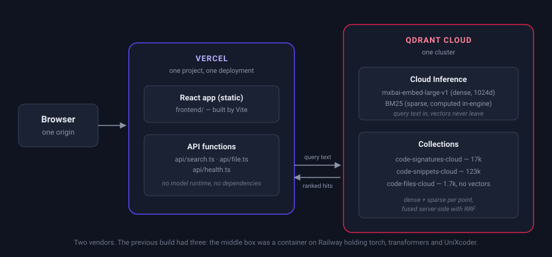

# Code Search with Qdrant

Developers need a code search tool that helps them find the right piece of code.
This repository is that tool, built on [Qdrant](https://qdrant.tech), searching
the [Qdrant source](https://github.com/qdrant/qdrant), and deployed as two
things: a Vercel project and a Qdrant Cloud cluster.

It is a rebuild of [qdrant/demo-code-search](https://github.com/qdrant/demo-code-search).
The interface is the same. What changed is everything behind it, and
[why](#why-this-was-rebuilt) is the interesting part.

## Online Version

The rebuild is deployed on Vercel. The previous build is still running on
Railway at
[demo-code-search-production.up.railway.app](https://demo-code-search-production.up.railway.app),
untouched, reading its own collections, so the two can be compared side by side.

`code-search.qdrant.tech` currently answers 404 and is not serving either of
them.

## Why This Was Rebuilt

The previous build needed three services to answer a search:

- **Vercel** served the frontend.
- **Railway** ran a FastAPI container that held `torch`, `transformers`,
  `sentence-transformers` and two models in memory, because the backend had to
  turn the query into a vector before it could ask Qdrant anything.
- **Qdrant Cloud** stored the vectors.

Railway existed only for that middle step. Qdrant Cloud Inference does the
embedding inside the cluster, so the query goes out as text and comes back as
ranked results. That leaves nothing for the container to do, and the backend
collapses into three small TypeScript functions that post JSON and can sit in
the same Vercel project as the frontend.

Two vendors, one deployment, two environment variables.



### The Catch, and What It Cost

`microsoft/unixcoder-base` is not in the Qdrant Cloud Inference catalog and cannot be
added to it. External models are reachable by prefix (`openai/`, `cohere/`,
`jinaai/`, `openrouter/`) but each one needs its own API key passed per request,
which is a third vendor by another name. So consolidating **forced replacing the
encoder**, and that made the model choice the whole migration rather than a
detail of it.

The replacement was picked by measurement, not by preference. See
[Benchmarks](#benchmarks).

### What This Gives Up

**You can no longer run the whole demo locally.** Qdrant Cloud Inference is a Qdrant
Cloud feature, so `docker run qdrant/qdrant` will not serve the models and the
collections cannot be built against a local instance. The previous build ran end
to end on a laptop with no accounts at all. This one needs a cluster, and the
free tier is what that costs.

`docker-compose.yaml`, the `Dockerfile` and `requirements.txt` are gone with it.
Nothing replaced them, which is the point, but it does mean the offline path is
gone too.

## Architecture

- [`frontend/`](frontend): React app, unchanged from the previous build except
  for the parts that named the old encoders.
- [`api/`](api): three Vercel functions. No dependencies at runtime; the whole
  API is `fetch` and JSON.
- [`indexer/`](indexer): builds the collections. No model runtime, because the
  cluster does the embedding.
- [`bench/`](bench): the measurements behind every number on this page.
  Stdlib-only, so anyone can re-run them.

Three collections, the same three as before:

| Collection | Points | What it holds |
|---|---|---|
| `code-signatures-cloud` | 17,187 | function and struct signatures, textified into something close to English |
| `code-snippets-cloud` | 123,257 | the code itself, chunked on folding ranges from rust-analyzer |
| `code-files-cloud` | 1,720 | whole source files, no vectors, so results can be shown in context |

A search queries the first two at once. The signature collection supplies the
results; the snippet collection says which line ranges inside them the second
search also picked out, and those get highlighted. The file collection is a
filtered scroll, used when someone clicks into a result.

### Chunking and Indexing

Semantic search works best on structured source. Each chunk corresponds to a
function, struct, enum, or another unit that makes sense on its own.

For the signature collection, the code is turned into a text-like representation
first, because a model trained on English does not read Rust. The `upsert`
function from `inverted_index_ram.rs` is stored as this structure:

```json
{
    "name": "upsert",
    "signature": "fn upsert (& mut self , id : PointOffsetType , vector : SparseVector)",
    "code_type": "Function",
    "docstring": "= \" Upsert a vector into the inverted index.\"",
    "line": 105,
    "line_from": 104,
    "line_to": 125,
    "context": {
        "module": "inverted_index",
        "file_path": "lib/sparse/src/index/inverted_index/inverted_index_ram.rs",
        "file_name": "inverted_index_ram.rs",
        "struct_name": "InvertedIndexRam",
        "snippet": "    /// Upsert a vector into the inverted index.\n    pub fn upsert(&mut self, id: PointOffsetType, vector: SparseVector) { ... }"
    }
}
```

and embedded as this sentence:

```text
Function upsert that does: = " Upsert a vector into the inverted index." defined as
fn upsert mut self id Point Offset Type vector Sparse Vector in struct InvertedIndexRam
in module inverted_index in file inverted_index_ram.rs
```

Module and file names carry real information in a well-organised codebase. That
`upsert` belongs to `InvertedIndexRam` in `inverted_index` says it is the
in-memory inverted index, which the function name alone does not. The conversion
is `textify` in [`indexer/textifier.py`](indexer/textifier.py).

Extracting the structures needs a parser per language. Rust uses the
[rust-parser](https://github.com/qdrant/rust-parser) project, built on
[syn](https://docs.rs/syn/latest/syn/index.html). Snippet boundaries come from
rust-analyzer's [LSIF](https://microsoft.github.io/language-server-protocol/specifications/lsif/0.4.0/specification/)
output, which is language-agnostic. Any language with an
[LSP implementation](https://microsoft.github.io/language-server-protocol/implementors/servers/)
can be chunked the same way.

### Search

Both collections are hybrid: a dense vector and a sparse one per point, both
produced by models running inside the cluster.

```jsonc
{
  "prefetch": [
    { "query": { "text": "cardinality of should request",
                 "model": "sentence-transformers/all-MiniLM-L6-v2" },
      "using": "dense",  "limit": 100 },
    { "query": { "text": "cardinality of should request",
                 "model": "Qdrant/bm25" },
      "using": "sparse", "limit": 100 }
  ],
  "query": { "fusion": "rrf" },
  "limit": 5
}
```

One round trip. The cluster embeds the query with both models, runs both
searches, fuses them with
[reciprocal rank fusion](https://plg.uwaterloo.ca/~gvcormac/cormacksigir09-rrf.pdf)
(Cormack, Clarke and Buettcher, 2009), and returns five results. The client
sends a string.

Nothing here is a new technique. Dense and sparse retrieval fused with RRF is a
standard hybrid setup, and Qdrant implements the fusion. What this repository
contributes is the measurement: which of the ten configurations actually wins on
code, and by how much.

Why both legs: dense retrieval and BM25 fail on opposite queries, and the
benchmark below shows exactly where. Someone searching `estimate_cardinality`
wants the lexical match. Someone searching "how does it guess how many points
come back" needs the dense one. Fusing costs one extra prefetch and no extra
round trip.

BM25 is worth a separate note: Qdrant computes it in-engine from collection
statistics, so unlike every other model in the catalog it bills **no inference
tokens**. The sparse half of every query here is free.

## Benchmarks

Every number here came out of [`bench/`](bench) and can be re-run. Nothing is
quoted from a model card.

### Picking the Encoder

`bench/bakeoff.py` indexes 5,000 chunks of `qdrant/qdrant` into one collection
with four vectors per point, then scores ten retrieval configurations through
the real production path: the cluster embeds the query, the cluster searches,
the cluster fuses.

Two query sets, because they disagree, and the disagreement is the finding:

- **docstring**: 300 docstrings lifted from the code they describe, so they
  share identifiers with the answer.
- **paraphrase**: 113 of the same intents rewritten to avoid those
  identifiers. Closer to what a person types.

| configuration | doc R@1 | doc R@10 | doc MRR | par R@1 | par R@10 | par MRR | p50 ms |
|---|---|---|---|---|---|---|---|
| minilm only | 0.613 | 0.863 | 0.694 | 0.071 | 0.327 | 0.137 | 53 |
| mxbai only | 0.817 | 0.973 | 0.876 | 0.106 | 0.381 | 0.175 | 112 |
| bm25 only | 0.893 | 0.993 | 0.932 | 0.035 | 0.142 | 0.068 | 32 |
| splade only | 0.903 | 0.993 | 0.935 | 0.035 | 0.133 | 0.068 | 110 |
| minilm + bm25 (RRF) | 0.787 | 0.983 | 0.870 | 0.071 | 0.283 | 0.134 | 56 |
| minilm + splade (RRF) | 0.787 | 0.983 | 0.870 | 0.088 | 0.292 | 0.144 | 113 |
| mxbai + bm25 (RRF) | 0.877 | 0.993 | 0.924 | 0.133 | 0.336 | 0.178 | 116 |
| mxbai + splade (RRF) | 0.877 | 1.000 | 0.925 | 0.124 | 0.336 | 0.171 | 118 |
| minilm + bm25 (DBSF) | 0.843 | 0.980 | 0.896 | 0.097 | 0.239 | 0.140 | 56 |
| mxbai + bm25 (DBSF) | 0.897 | 0.990 | 0.932 | 0.133 | 0.292 | 0.167 | 119 |

5,000 candidates, one correct answer each, 100 candidates per leg before
fusion. p50 is the Qdrant round trip from a laptop in the same country as the
cluster, over a kept-alive connection.

What it says:

**Lexical search wins the docstring set and loses the paraphrase set, badly.**
BM25 alone gets 0.993 recall@10 when the query shares identifiers with the
answer, and 0.142 when it does not. Any benchmark built only from docstrings
would conclude that the dense leg is dead weight. It would be wrong about every
query a visitor actually types.

**SPLADE never earns its cost.** It ties BM25 on the docstring set, loses on
the paraphrase set, runs three times slower, and bills inference tokens where
BM25 bills none. BM25 is computed in-engine from collection statistics, so the
sparse half of this system is free at any corpus size.

**DBSF was tried and rejected.** Reciprocal rank fusion gives each leg half a
vote by position, which looked wasteful on paraphrase queries where the lexical
leg contributes noise. Distribution-based fusion should have let a confident
dense score outvote a weak lexical one. It did the opposite: it lets a
confident *lexical* score dominate, and on paraphrases BM25 is confidently
wrong. Paraphrase recall@10 fell from 0.336 to 0.292.

### A Model Served Differently Than Its Model Card

The in-cluster `all-MiniLM-L6-v2` scores 0.863 docstring recall@10 here. An
offline run of the same model, on the same 5,000 documents and the same 300
queries, scored 0.933.

Probing the service with progressively longer input shows it truncates at
**512 tokens**. The published `sentence-transformers` configuration for this
model sets `max_seq_length` to **256**. It was trained at that length, and
positions beyond it are ones it barely saw. 36% of this corpus is longer than
256 tokens, so more than a third of it was being embedded with positions the
model was never trained on.

`bench/truncation.py` indexes the corpus again with every document cut to 700
characters, roughly 256 tokens of Rust, and scores it the same way.

| input | doc R@10 | doc MRR | par R@10 | par MRR |
|---|---|---|---|---|
| minilm, full text | 0.863 | 0.694 | 0.327 | 0.137 |
| minilm, cut to ~256 tokens | 0.937 | 0.791 | 0.310 | 0.167 |
| minilm + bm25, full text | 0.983 | 0.870 | 0.283 | 0.134 |
| minilm + bm25, cut | 0.983 | 0.913 | 0.319 | 0.126 |

Cutting the input takes MiniLM from 0.863 to 0.937 docstring recall@10, which is
the 0.933 the offline run got. The window is the cause.

Two things follow. Anyone using `all-MiniLM-L6-v2` through Qdrant Cloud Inference on
documents longer than 256 tokens is losing recall and has no way to see it from
the API. And for this demo it is moot, because `mxbai-embed-large-v1` has a
native 512-token limit, so the service's window is the model's window and there
is nothing to cut. [`indexer/build.py`](indexer/build.py) still carries an
`INDEX_CHAR_BUDGET` for anyone who switches back to a 256-token model; it
defaults to 0.

### Why mxbai and Not the Free Model

| | mxbai + bm25 | minilm + bm25 (cut) |
|---|---|---|
| docstring recall@10 | **0.993** | 0.983 |
| docstring MRR | **0.924** | 0.913 |
| paraphrase recall@10 | **0.336** | 0.319 |
| paraphrase MRR | **0.178** | 0.126 |
| paraphrase recall@1 | **0.133** | 0.035 |
| p50 | 116 ms | **54 ms** |
| dimensions | 1024 | **384** |
| tokens to index 140k points | 65.4 M | **0**, MiniLM is free |

On docstring queries these are close enough that either would do. They separate
on the paraphrase set, and that is the set that matters: a visitor types a
description, not a docstring. mxbai puts the right function first for 13.3% of
those queries against MiniLM's 3.5%. The demo is judged on the first result, so
it pays for the model.

Reproduce the whole comparison with `python bench/bakeoff.py` and
`python bench/truncation.py`.

### What a Full Index Costs

The index that is deployed was built in one run, and the cluster reports what it
charged, so these are measured rather than projected.

| collection | points | wall clock | mxbai tokens |
|---|---|---|---|
| `code-files-cloud` | 1,720 | 4 s | 0, it holds no vectors |
| `code-signatures-cloud` | 17,187 | 3.4 min | 2,262,210 |
| `code-snippets-cloud` | 123,257 | 22.3 min | 28,164,640 |
| **total** | **142,164** | **~26 min** | **30,426,850** |

BM25 appears nowhere in that column. The engine derives it from collection
statistics, so the sparse half of the index cost nothing and will keep costing
nothing however far the corpus grows.

`bench/index_cost.py` estimates this ahead of a run by embedding a uniform
sample and multiplying. It predicted 65.4M against the 30.4M actually charged,
and the gap is instructive: it sampled the evaluation corpus, whose text field
is a signature and its snippet concatenated, while the deployed collections
embed each of those separately. Sample the thing you are going to embed, not
something shaped like it.

Per-model prices live on the Inference tab of the cluster page in the Cloud
Console and are deliberately not copied here, because a stale price in a
repository is worse than no price. A full rebuild is a one-off in any case.
Answering a search costs 36 to 46 tokens, measured on the deployed demo: the
query is embedded once per collection, and the two BM25 legs cost nothing. The
`/api/search` response carries the figure as `inference_tokens` so it stays
checkable rather than asserted.

### Against the Demo It Replaces

Both deployments answered the same 413 queries over the same 123k corpus on the
same day, five results each, scored by `bench/quality.py`.

| | R@1 | R@5 | file R@5 | MRR |
|---|---|---|---|---|
| **rebuild**, docstring | **0.887** | **0.983** | **0.983** | **0.930** |
| old demo, docstring | 0.567 | 0.907 | 0.913 | 0.713 |
| **rebuild**, paraphrase | 0.097 | 0.177 | 0.257 | 0.127 |
| old demo, paraphrase | 0.106 | 0.195 | 0.257 | 0.142 |

The paraphrase row looks like a small regression and is not one.
`bench/significance.py` compares the two rankings query by query with a paired
bootstrap and an exact sign test, because a 0.015 gap across 113 queries is well
inside what four queries landing differently can produce:

| comparison | MRR difference | 95% interval | sign test |
|---|---|---|---|
| docstring | **+0.125** | [+0.091, +0.161] | p < 0.001, 66 better / 11 worse |
| paraphrase | −0.012 | [−0.074, +0.051] | p = 0.44, 11 better / 16 worse |

The docstring gain is real and large. The paraphrase difference cannot be
distinguished from zero on this many queries, so the honest claim is a decisive
win on one set and a draw on the other, not a trade.

The sparse leg was checked the same way rather than assumed. Against dense
alone it is worth +0.041 MRR on docstring queries, interval [+0.020, +0.062],
p = 0.001. On paraphrase queries dense alone wins more queries than it loses,
16 to 3, but the MRR interval straddles zero. So BM25 earns its place on the
evidence that exists, and the case against it does not.

### Where This Stops Working

Four boundaries, all of them visible in the numbers above.

**Vague natural language still mostly fails.** Paraphrase recall@5 is 0.177. A
visitor who types "how does it decide what to keep in memory" will usually not
get the right function in five results, from this build or the one it replaces.
The docstring numbers are the flattering ones and they are flattering because
those queries share identifiers with their answers.

**One repository, one language.** Chunking depends on rust-analyzer for snippet
boundaries and on `qdrant/rust-parser` for signatures. Another language needs
its own parser and an LSP that emits LSIF. Nothing above transfers untested.

**142k points on one cluster.** Everything here was measured at that size. RRF
behavior and the prefetch of 100 per leg were not tuned for a corpus an order
of magnitude larger, and the sparse leg's advantage is a property of this
corpus's identifier vocabulary rather than a general result.

**The index is a snapshot.** Results resolve against one commit of
`qdrant/qdrant`. The moment that branch moves, line numbers drift, and nothing
in the running demo notices. `INDEXED_COMMIT` is the seam.

### A Ranking Bug, Inherited

The first head-to-head scored the rebuild at 0.620 docstring recall@1 while the
signature search underneath it was returning the right function first 88.7% of
the time. The merge step was throwing that away.

`merge_search_results` sorted results by how many overlapping snippet ranges
each one had, on the theory that results both searches agreed on should come
first. In practice a result with two highlighted line ranges was promoted over
the actual best match with none. Removing the re-sort moved docstring recall@1
from 0.620 to 0.887 and MRR from 0.768 to 0.930, and changed nothing else:
overlap still decides which lines are highlighted.

This was inherited, not introduced. Measured directly, the old demo's own
signature search scores 0.730 recall@1, while the deployment built on top of it
returns 0.567. Same re-sort, same cost, and it has been there the whole time.

### Latency

Both deployments, 60 searches each, from the same machine over a kept-alive
connection, queries varied so nothing is answered from a cache.

| | first request | p50 | p95 | server p50 |
|---|---|---|---|---|
| **rebuild** | 495 ms | **148.8 ms** | 233.2 ms | 91 ms |
| old demo | 438 ms | 176.7 ms | **188.2 ms** | **81 ms** |

`server` is what the function reports it spent talking to Qdrant, so the gap
between it and end-to-end is the platform and the network.

The rebuild is faster at the median and slower at the p95. That tail is the
honest cost of serverless: a container that is always warm has a flatter
distribution than functions that are not. The first request is comparable, which
surprises people who expect a cold start to dominate. There is no model to load
any more, so there is nothing to be cold about.

**Where the tail comes from.** Measured directly against Qdrant, the BM25 leg
answers in 32.0 ms p50 and 33.4 ms p95, a spread of 1.4 ms. The mxbai leg
answers in 110.9 ms p50 and 156.9 ms p95, a spread of 46.0 ms. The function's
whole server-side spread is 54 ms, so 46 of it is the dense model's inference
call and the platform contributes about eight. The old demo ran a smaller model
in-process on a warm container, which is why its distribution is nearly flat at
80 ms p50 and 84 ms p95. That determinism is what was traded for a model that
finds the right function 56% more often.

**Repeated queries are free.** The three example queries on the landing page get
clicked far more than anything anyone types, and Qdrant Cloud Inference re-embeds
every request: an identical query costs the same 117 ms as a novel one. So the
function keeps a small bounded cache of whole responses, which skips the
embedding and the search together. On traffic where the examples dominate, p50
falls to 52.9 ms, most of which is the network rather than the demo. On the
benchmark above, where every query is deliberately different, it changes nothing.

The old backend cached the query vector instead. That option is gone: the
cluster embeds and never returns the vector, so there is nothing of that shape
to keep. Caching the answer is strictly more of the work, and it is only safe
because the index is a snapshot rebuilt by an explicit run rather than updated
underneath the reader.

**Region pinning is doing most of the work here.** The cluster is in AWS
us-west-2 and Vercel defaults functions to iad1 in Virginia, so every search
crossed the country and back, twice, once per collection. Before pinning to
pdx1, the same benchmark reported 273.8 ms p50 and 163 ms server. One line in
[vercel.json](vercel.json) took the median from 273.8 ms to 148.8 ms. Anyone
deploying this against a cluster in another region should change that line
first, and the health endpoint will not tell them: a cross-region deployment is
perfectly healthy and quietly twice as slow.

## Running It Yourself

See [DEPLOY.md](DEPLOY.md). Short version: create a Qdrant Cloud cluster with
inference enabled, build the index, import this repo into Vercel, set
`QDRANT_URL` and `QDRANT_API_KEY`.

### Prerequisites for Building the Index From Source

- **Qdrant 1.10 or newer**, with Qdrant Cloud Inference enabled. The two-leg
  `prefetch` plus `fusion` query needs 1.10; inference is what embeds the query.
- [Rust](https://www.rust-lang.org/learn/get-started) and
  [rust-analyzer](https://rust-analyzer.github.io/) for snippet boundaries
- [Docker](https://www.docker.com/) for the rust-parser container

```shell
rustup component add rust-analyzer
export QDRANT_URL="https://your-cluster-id.region.aws.cloud.qdrant.io:6333"
export QDRANT_API_KEY="..."
bash tools/download_and_index.sh
```

Nothing in that list is a Python model dependency, and there is no
`requirements.txt`. The indexer is stdlib.

### Local Development

```shell
cp .env.example .env.local     # QDRANT_URL and QDRANT_API_KEY
npm install
npx vercel dev
```

http://127.0.0.1:3000 serves the app and the API together, the same way
production does.

## Further Steps

1. Turn off one leg of the hybrid query and watch which queries break. The
   paraphrase set below is the interesting half.
2. Swap the dense model. `bench/bakeoff.py` scores a new one against the same
   corpus in one command.
3. Fork it for a language other than Rust. The chunking is the only part that
   is Rust-specific.
4. Build a ground truth set for your own codebase and re-run `bench/quality.py`
   against it. Every claim on this page came out of that script.
